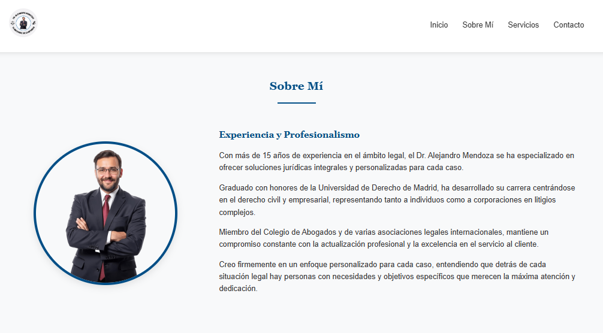

# ⚖️ Bufete Legal - Tu aliado en soluciones legales

**Bufete Legal** es una landing page profesional diseñada para abogados y estudios jurídicos que buscan una presencia web elegante, moderna y funcional.  
Desarrollada completamente con **HTML y CSS puro**, combina una estética limpia con una estructura clara y adaptable a cualquier dispositivo.

## 🌐 Demo

## 📸 Vista previa

## 💼 Descripción

El sitio presenta la página profesional del **Dr. Alejandro Mendoza**, abogado especializado en derecho civil y empresarial.  
Está diseñado para inspirar confianza y profesionalismo, destacando la experiencia, los servicios ofrecidos y una vía de contacto directa.

## 🧩 Características principales

* 🏛️ **Sección Hero** con fondo elegante, texto animado y llamada a la acción.
* 👨‍⚖️ **Sobre Mí**: presentación profesional con foto circular y descripción detallada.
* ⚙️ **Servicios**: cards limpias y adaptables con animaciones suaves.
* 📞 **Contacto**: formulario funcional y sección de información directa.
* 🌍 **Diseño 100% responsive** para todos los dispositivos.
* 🎨 **Paleta de colores** sobria y profesional (azul marino, blanco y gris).
* 💬 Animaciones “fade-in” para una experiencia fluida y moderna.

## 📂 Estructura del proyecto
### BufeteLegal/
### │── 📂assets
### │── 📂css
###     │── style.css
### │── 📂js
###     │── script.js
### │── preview.png
### └── README.md

> 💡 Todos los estilos están integrados directamente en el archivo HTML para simplificar la implementación y asegurar compatibilidad total.

## 🛠️ Tecnologías utilizadas

* **HTML5** → estructura semántica y secciones organizadas.
* **CSS3** → tipografía, animaciones, diseño responsive y estilo visual.

## 📈 Optimización y enfoque

Este diseño prioriza:
- Legibilidad y jerarquía visual.
- Accesibilidad y navegación intuitiva.
- Estética profesional para captar la atención de potenciales clientes.

## 🤝 Disponible para contratación

¿Querés una página igual de profesional para tu estudio o servicio?  
Podés obtener una **landing page como esta en mi perfil de Fiverr por solo $5 USD**.  

👉 [Visitar mi Fiverr](https://es.fiverr.com/aramirezthomas?public_mode=true)

## 📝 Licencia

Este proyecto está bajo la **MIT License**.  
Libre para usar, modificar y compartir.

# Diseñado con dedicación y atención al detalle.